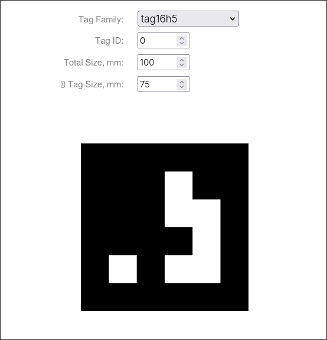

# Sprint 03 | IoT

## Integrantes

| Nome |  RM  |
| ---- | :--: |
| Otavio Miklos Nogueira | 554513 |
| Luciayla Yumi Kawakami | 557987 |
| João Pedro Amorim Brito | 559213 |

## Links
Youtube: [https://youtu.be/rWVnhiwgf3U](https://youtu.be/rWVnhiwgf3U)

## Tecnologias

Esse é um projeto completo composto por
- Spring Boot
- React
- Python
  - OpenCV
- Apriltag
- Docker & Docker Compose

## Rodando

### Requisitos

- Docker & Docker Compose
- Postman | Insomnia
- WebCam

### Comandos

```bash
# Clone o projeto
git clone https://github.com/omininola/sprint3_iot

# Mude o diretório
cd sprint3_iot/project

# Rode o Docker Compose
docker compose up -d --build
```

Na primeira vez subindo os containers, pode ser que demore um pouco, pois é necessário que as imagens do MySQL e MongoDB sejam instaladas. E que os serviços do Server (Java API), Client (React) e Tag Recognition (Python) sejam buildados.

### Problemas

#### Acesso da câmera

O Docker Compose precisa que a WebCam seja passada para dentro do container, no linux isso é feito facilmente com a seguinte opção no Docker Compose

```yml
devices:
  - /dev:/dev
```

Porém se o seu sistema for Windows ou Mac, essa tarefa pode não ser tão simples assim. Pois o Windows utiliza uma VM para rodar os containers do Docker, então a VM teria que ter acesso a WebCam também.  

#### Portas

Pode ser que dê algum problema na hora de rodar os containers, caso isso ocorra, cheque se já existe algum recurso rodando em alguma das portas:
- 8080
- 5000
- 3000

Se houver, você pode alterar o Docker Compose para mapear para outras portas

### Testes

Para iniciar os testes, teremos que criar alguns recursos

#### Filial

```bash
curl -X POST http://localhost:8080/subsidiaries \
  -H "Content-Type: application/json" \
  -d '{
    "name": "Barueri",
    "address": {
      "street": "Rua dos Bobos",
      "zipCode": "123",
      "city": "Osasco",
      "state": "São Paulo",
      "country": "Brasil"
    }
  }'
```

#### Pátio

```bash
curl -X POST http://localhost:8080/yards \
  -H "Content-Type: application/json" \
  -d '{
    "name": "Barueri I",
    "subsidiaryId": 1,
    "boundary": [
      { "x": 0, "y": 0 },
      { "x": 180, "y": 0 },
      { "x": 180, "y": 80 },
      { "x": 0, "y": 80 }
    ]
  }'
```

#### Tags

```bash
curl -X POST http://localhost:8080/apriltags \
  -H "Content-Type: application/json" \
  -d '{
    "code": "tag16h5_0",
    "subsidiaryId": 1
  }'
```

#### Motos

```bash
curl -X POST http://localhost:8080/bikes \
  -H "Content-Type: application/json" \
  -d '{
    "plate": "ABC123",
    "chassis": "fsdvdvcaasd",
    "model": "POP",
    "status": "READY"
  }'
```

Com os recursos em mãos, podemos começar a parte mais interessante!

Entre no site [https://chaitanyantr.github.io/apriltag.html](https://chaitanyantr.github.io/apriltag.html), esse site é um gerador de Apriltags online. Escolha a família "tag16h5" e deixe a Tag ID com o valor de 0

Deve aparecer algo mais ou menos assim:


Nesse momento, tire uma foto da tela com o celular e já deixe a foto aberta

Agora entre nesses dois links aqui:
- [http://localhost:3000](http://localhost:3000)
- [http://localhost:5000/video](http://localhost:5000/video)

No site selecione a filial "Barueri", nesse momento todos os pátios dessa filial devem ser carregados.

Agora basta mostrar a foto da tag para a câmera e a mágica já deve estar acontecendo!

A tag no momento ainda não foi vinculada a nenhuma moto, então você pode vincular simplesmente passando o mouse por cima da tag no mapa e então vinculando ela com o cardzinho a direita ou embaixo do mapa (Vai depender do tamanho da tela), basta preencher a placa da moto e vincular!

## Limpar a Máquina

```bash
# Parar os containers
docker compose down -v

# Remover as Imagens do MySQL, MongoDB, Java, Python e Node
docker image rm mysql:8 mongo mottu-client mottu-tag_detection mottu-server

# Remover os Volumes
docker volume rm mottu_db_mongo mottu_db_mysql
```